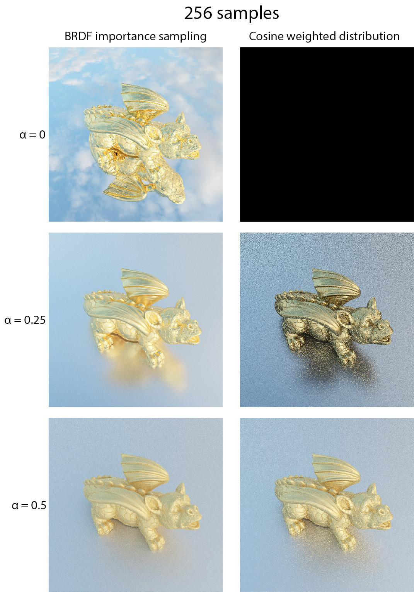

Path tracing engine written in C++. This project was initially written using SYCL. SYCL is a standard written by the Khronos Group that allows one C++ code to be ran on multiple devices including CPUs, GPUs and even FPGA accelerators. 
Unfortunately, I have been facing issues (discussions with Intel can be found [here](https://community.intel.com/t5/Intel-oneAPI-Data-Parallel-C/SYCL-kernel-hangs-on-long-workloads/m-p/1536759#M3358) and [here](https://community.intel.com/t5/Intel-oneAPI-Data-Parallel-C/Can-t-find-the-source-of-memory-corruption-in-SYCL-ray-tracer/m-p/1539563#M3383)) with SYCL that lead me to reimplement it in pure C++ (the task was pretty much effortless as a SYCL code is already very close to pure C++).

This project has been superseded by my [HIPRT-Path-Tracer](https://github.com/TomClabault/HIPRT-Path-Tracer) written with the HIPRT GPU Ray Tracing API and largely expanded in functionalities.

Implemented features:
- Direct lighting
- Indirect lighting

- Microfacet BRDF (Cook Torrance BRDF) : Roughness and metallic
- Cook Torrance BRDF Importance Sampling

- HDR Environment Map
- Environment Map Importance Sampling
- Multiple Importance Sampling
- Tone mapping HDR (gamma and exposition)
- Octree based BVH + 7 planes bounding volumes
- Linear BVH adapted for GPU computations
- Intel® Open Image Denoise integration
